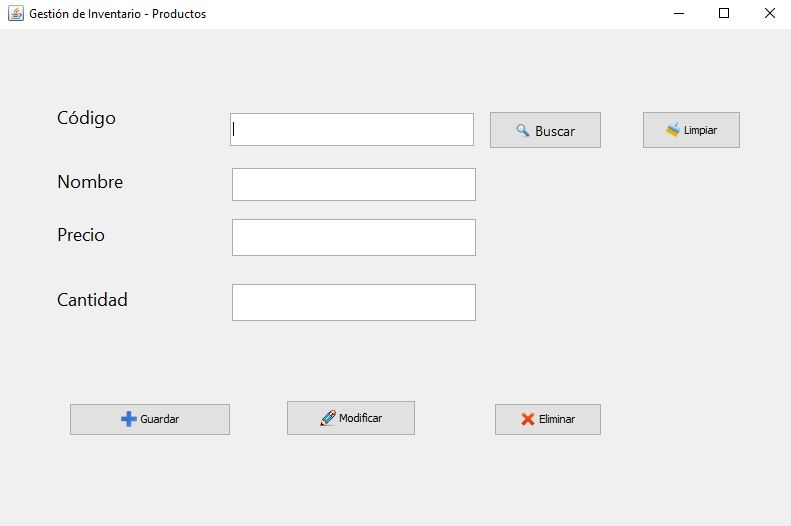

# 📦 Sistema de Gestión de Inventario

Aplicación de escritorio desarrollada en **Java** para la administración y control de stock. Este proyecto destaca por el uso de una arquitectura limpia y patrones de diseño profesional.

---

## 🛠️ Tecnologías y Arquitectura

Este proyecto no es solo funcional, sino que sigue estándares de la industria:

* **Lenguaje:** Java (JDK 21) + Swing (GUI).
* **Base de Datos:** MySQL.
* **Arquitectura:** MVC (Modelo-Vista-Controlador).
* **Patrones:** DAO (Data Access Object) para separar la lógica de negocio del acceso a datos.
* **Seguridad:** Uso de `PreparedStatements` para evitar Inyección SQL.

---

## ⚙️ Instalación y Puesta en Marcha

Si quieres probar el proyecto en tu máquina local, sigue estos pasos:

### 1. Base de Datos 🗄️
El proyecto requiere una base de datos MySQL.
1.  Abre tu gestor (Workbench, phpMyAdmin, DBeaver).
2.  Importa el script SQL que encontrarás en la carpeta:
    `database/tienda.sql` (o el nombre que tenga tu script).

### 2. Configuración 🔧
Es posible que necesites ajustar las credenciales de conexión a la base de datos para que coincidan con las de tu ordenador.
1.  Ve a `src/tu_paquete/config` (o donde tengas la clase Conexión).
2.  Abre el archivo `.java` de conexión.
3.  Verifica que el `user` y `password` sean los correctos para tu MySQL local.

### 3. Ejecución ▶️
Compila y ejecuta el archivo `Main.java` desde tu IDE favorito (NetBeans, IntelliJ, VS Code).

---

## 📋 Funcionalidades Principales
* ✅ **CRUD Completo:** Crear, Leer, Actualizar y Borrar productos.
* ✅ **Gestión de Stock:** Control de cantidades disponibles.
* ✅ **Interfaz Intuitiva:** Diseño limpio utilizando Java Swing.

---

    Desarrollado por <a href="https://github.com/briankm7">Brian</a> - Estudiante de DAM

